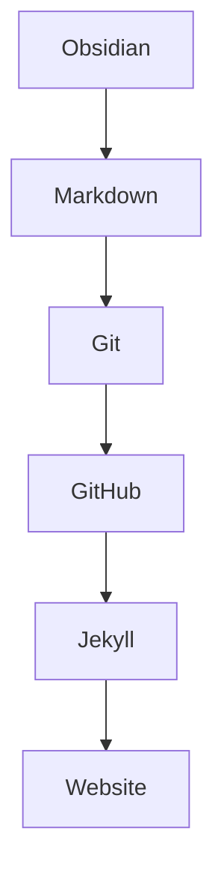
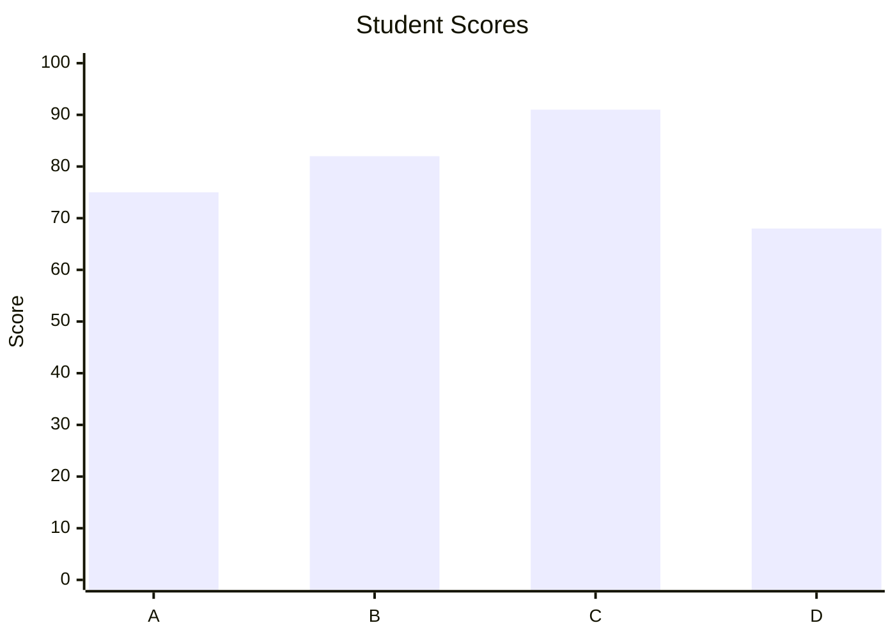

$$
x(t) = x_0 + v_0t + \frac{1}{2}at^2
$$

```python
import pygame

screen = pygame.display.set_mode((800, 600))

# while True:
    # ...
```



<div class="exercise">
  <h3>🏋️ Exercise</h3>

  <p>
    A car accelerates from 0 m/s to 20 m/s in 5 seconds.
    What is its acceleration?
  </p>

  <details>
    <summary style="color:#ff0000;">Show answer</summary>

    <p>
      <strong>a = Δv / Δt</strong>
    </p>

    <p>
      a = 20 / 5 = 4 m/s²
    </p>
  </details>
</div>